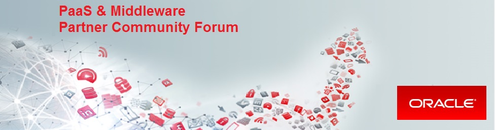

This repository contains labs material for **PaaS & Middleware Partner Community Forum Bootcamps**.

## Preparation

In order to complete Lab 1 you need Oracle Enterprise Pack for Eclipse (OEPE) installed on your desktop. Go to [OEPE download page](http://www.oracle.com/technetwork/developer-tools/eclipse/downloads/index.html) accept OTN license agreement and download the suitable distribution of OEPE. Choose the latest *Eclipse Neon* version. The format is zip, so once the download has been completed extract and start when it is needed during labs.

## Lab 1

Support SpringBoot application development lifecycle using Oracle Developer Cloud Service, Application Container Cloud Service and Oracle Enterprise Pack For Eclipse

+ [Create Oracle Developer Cloud Service project for SpringBoot application](springboot-sample/create.devcs.project.md)
+ [Create continuous build integration using Oracle Developer Cloud Service and Oracle Application Container Cloud Service](springboot-sample/devcs.accs.ci.md)
+ [Using Eclipse IDE (Oracle Enterprise Pack for Eclipse) with Oracle Developer Cloud Service](oepe/setup.oepe.md)

## Lab 2

Integrate telemetry setup into continuous delivery and monitor an application using the Oracle Management Cloud

+ [Deploying APM Agent on Apache Tomcat based application and setting up Application Performance Monitoring](apm/README.md)

## Lab 3

+ [Deploy complex cloud environment using Oracle Cloud Stack](stack/README.md)

### [Contributing](CONTRIBUTING.md)
Pull Requests are currently not being accepted. See [CONTRIBUTING](CONTRIBUTING.md) for details.

### [License](LICENSE.md)
Copyright (c) 2014, 2016 Oracle and/or its affiliates
The Universal Permissive License (UPL), Version 1.0
